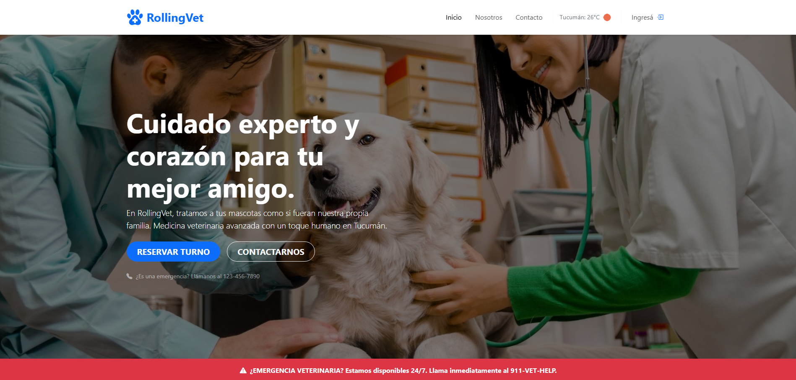
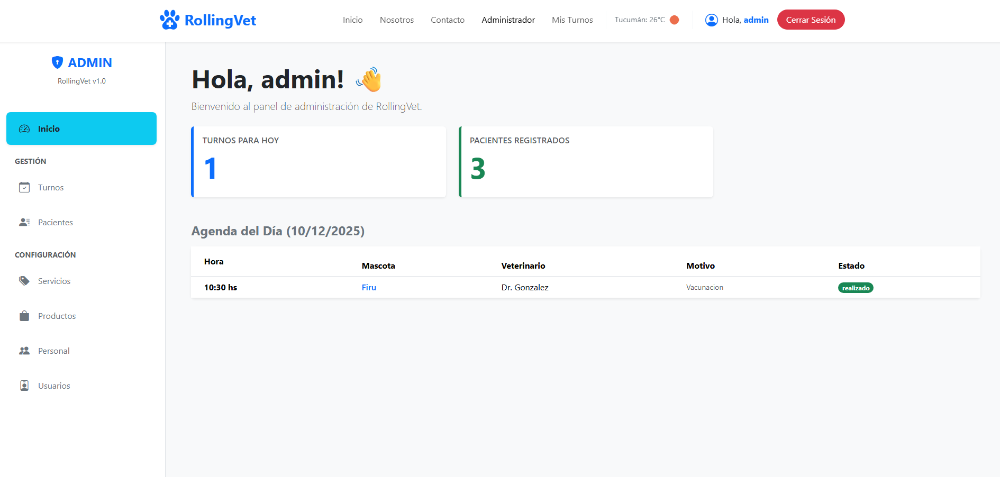
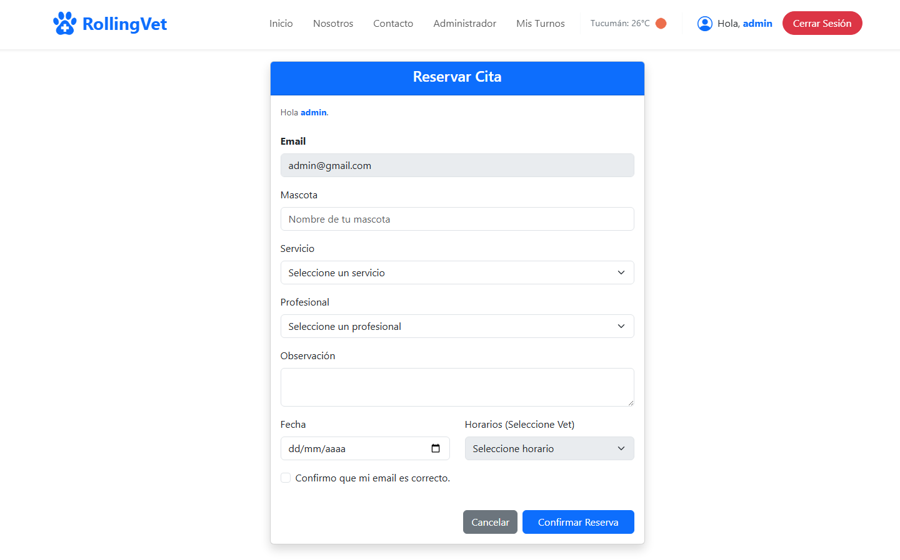

🐾 RollingVet - Sistema de Gestión Veterinaria
==============================================

**RollingVet** es una aplicación web Full Stack diseñada para modernizar la gestión integral de una clínica veterinaria. Este sistema ofrece una doble interfaz: un **portal público** intuitivo para que los clientes reserven turnos y consulten servicios, y un completo **panel de administración** para gestionar la clínica eficientemente.

📸 Capturas de Pantalla
-----------------------

### Vista Principal (Home)



### Panel de Administración (Dashboard)



### Reserva de Turnos



🎥 Video Demo
-------------

¡Mira el funcionamiento completo de la aplicación en este video!


🚀 Tecnologías Utilizadas
-------------------------

El proyecto fue desarrollado utilizando el stack **MERN**:

### Frontend (Cliente)

*   **React + Vite**: Para una experiencia de usuario rápida y fluida (SPA).
    
*   **React Bootstrap**: Diseño responsive, profesional y consistente.
    
*   **React Router DOM**: Gestión de rutas públicas y privadas.
    
*   **EmailJS**: Integración para envío de correos electrónicos automáticos (Formularios de Contacto y Planes).
    
*   **SweetAlert2**: Notificaciones y alertas interactivas.
    
*   **OpenWeatherMap API**: Widget de clima en tiempo real.
    

### Backend (Servidor)

*   **Node.js & Express**: API RESTful robusta y escalable.
    
*   **MongoDB & Mongoose**: Base de datos NoSQL para modelos flexibles.
    
*   **JWT (JSON Web Token)**: Autenticación segura y protección de rutas.
    
*   **Bcrypt.js**: Encriptación de contraseñas.
    
*   **Cors & Morgan**: Middlewares de seguridad y logging.
    

✨ Funcionalidades Principales
-----------------------------

### 🌍 Portal Público (Usuarios)

*   **Inicio Dinámico**: Sección de bienvenida con widget de clima, marcas aliadas y destacados.
    
*   **Reserva de Turnos**: Formulario inteligente que valida horarios disponibles según el veterinario seleccionado.
    
*   **Planes de Salud**: Información detallada de coberturas con solicitud de información automática vía email.
    
*   **Autenticación**: Registro e inicio de sesión de usuarios seguro.
    
*   **Contacto**: Formulario de consultas generales validado.
    

### 🔐 Panel de Administración (Privado)

*   **Dashboard**: Vista rápida con métricas del día y agenda de turnos.
    
*   **Gestión de Turnos**: Tabla paginada con estados (Pendiente, Realizado, Cancelado).
    
*   **Gestión de Pacientes**: CRUD completo con buscador en tiempo real y paginación.
    
*   **Administración Total**: Control total sobre Servicios, Productos, Profesionales y Usuarios.
    
*   **Seguridad**: Rutas protegidas que impiden el acceso no autorizado.
    

🛠️ Instalación y Configuración
-------------------------------

Sigue estos pasos para ejecutar el proyecto en tu entorno local:

### 1\. Clonar el repositorio

```bash 
  git clone 
  cd rollingvet   
```
### 2\. Configurar el Backend

Navega a la carpeta del servidor e instala las dependencias:

```bash
  cd backend  
  npm install   
```

Crea un archivo .env en la carpeta backend con las siguientes variables:

```bash
  PORT=4000
  DATABASE_URI=mongodb+srv://:@cluster.mongodb.net/rollingvet
  SECRET_JWT=TuPalabraSecretaSuperSegura
```

Inicia el servidor:


```bash
  npm start 
```


### 3\. Configurar el Frontend

Navega a la carpeta del cliente e instala las dependencias:

```bash
  cd frontend
  npm install 
```


Crea un archivo .env en la carpeta frontend para conectar con tu API:

```bash
  VITE_API_URL=http://localhost:4000/api
```
Inicia la aplicación:

```bash
  npm run dev 
```


🧪 Credenciales de Prueba (Demo)
--------------------------------

Para explorar las funcionalidades de administrador, puedes utilizar el siguiente usuario (si ya está cargado en tu BD):

*   **Email:** admin@rollingvet.com
    
*   **Contraseña:** admin123
    

✒️ Autor
--------

**Nicolás Paz**

*   **Rol:** Desarrollador Full Stack
    
*   **LinkedIn:** [linkedin.com/in/nicopazz](https://www.linkedin.com/in/nicopazz/)
    
*   **GitHub:** [github.com/nicopazz](https://github.com/nicopazz)
    

## Demo

* [rollingvet.com](demo)

_Proyecto realizado como parte de la certificación Full Stack Developer._